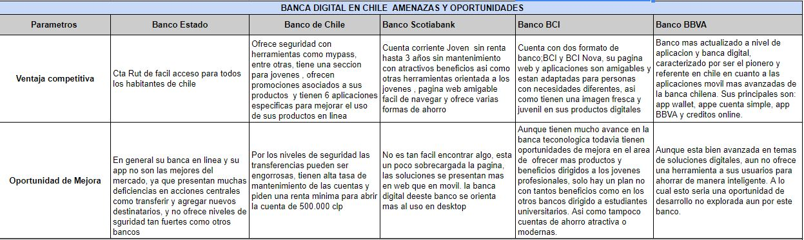
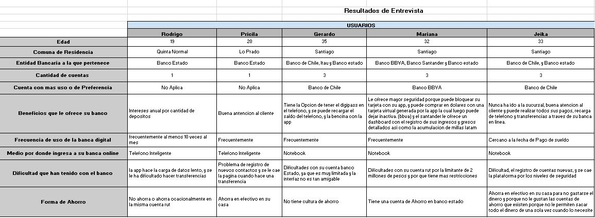
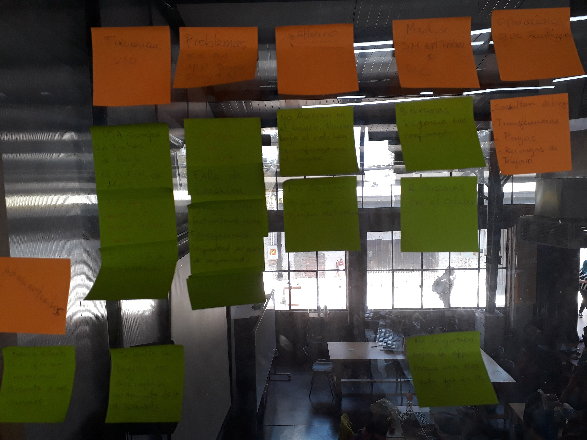

# PROYECTO BANCA DIGITAL (App BankAhorro)
# Proyecto UX Design Elaborado para Laboratoria (2018) 

# Tecnologia Usada: Marvel app (prototipado) 
Tecnicas de Investigación: User Research, Entrevistas, y encuestas, arquetipos o user person, Benchmarking

#### Diseñando una solucion bancaria para Los Millenials 

El banco MI PAIS, entendiendo la amenza que suponen los nuevos formatos de bancos 100% digitales, como NuBank, Simple entre otros, ha decidido que tambien quiere irse adaptando a las nuevas tecnologías, por lo cual a solicitado la creación de una solucion digital enfocada en captar al publico Millenial.  Generacion  de la hiperconexion, donde tienen una necesidad de ser mas libre, mas independiente, la necesidad de inmediatez, así como su búsqueda constante de nuevas experiencias. Personas que llegaron a la adultez despues del año 2000, que se adapta rapidamente a los cambios, suelen rondar entre los 15 a 35 años. 

#### Investigación 

###### Mi parte 

En primera instancia para conocer mejor el entorno en santiago de chile respecto a esto se realiza un Benchmarking entre los principales banco de Chile, en el cual se determino lo siguiente:
Ninguno de los banco actuales ofrencen una forma de ahorro facil e innovadora que atraiga a este joven millenial.
No trasmiten la seguridad y control de sus ahorros que requieren los usuarios.
Tienen una imagen poco fresca o tradicional que todos tienen algo en común, lo cual no empatiza con este tipo de usuario. 

#### Analisis de las entrevistas:

Entreviste a varios usuarios con el perfil de Millenial y basado en el analisis que realice determine los siguientes insghts:

1.	No confían en su banco para ahorrar, ahorran en efectivo en su casa.
2.	Los bancos no le ofrecen planes de ahorros donde sientan el control de su dinero
3.	No tienen cultura o enseñanza de ahorro.

#### En conjunto con el equipo se determino lo siguiente:

Dado los resultados obtenidos en la investigación tanto en terreno como la investigación del mercado y contexto actual de la banca digital en chile se llega a la conclusión que lo mas valioso para nuestro usuario Millenial, teniendo en cuenta que sus 3 necesidades básicas son:

*	La libertad y control de su dinero
*	La confianza y seguridad en su banco
*	Crear la cultura y disciplina del ahorro 

se define que la mejor oportunidad para llegar al objetivo del banco tanto como cumplir las expectativas y necesidades de nuestro usuario millenial seria crear una app movil para incentivar el ahorro y ayudar a nuestro ususario a crear el habito. 

#### Carcteristicas Principales de esta app serian:

Facil acceso para cualquier joven que quiera ahorrar
Definir una meta, para que tenga buenos habitos de ahorro y sea mas facil el ahorro
Tiene al menos dos metas para que este usuario empiece ahorrar, una como opcion de la app y la otra libre.

#### Creación del wireframe app BankAhorro version desktop y mobile
Primero se consideraron todos los objetivos y se observaron varias app en el mercado y se tomo ideas de las cosas buenas que tenian:
 

#### Versión Desktop

#### Versión Mobile (Mi parte)

 

 

